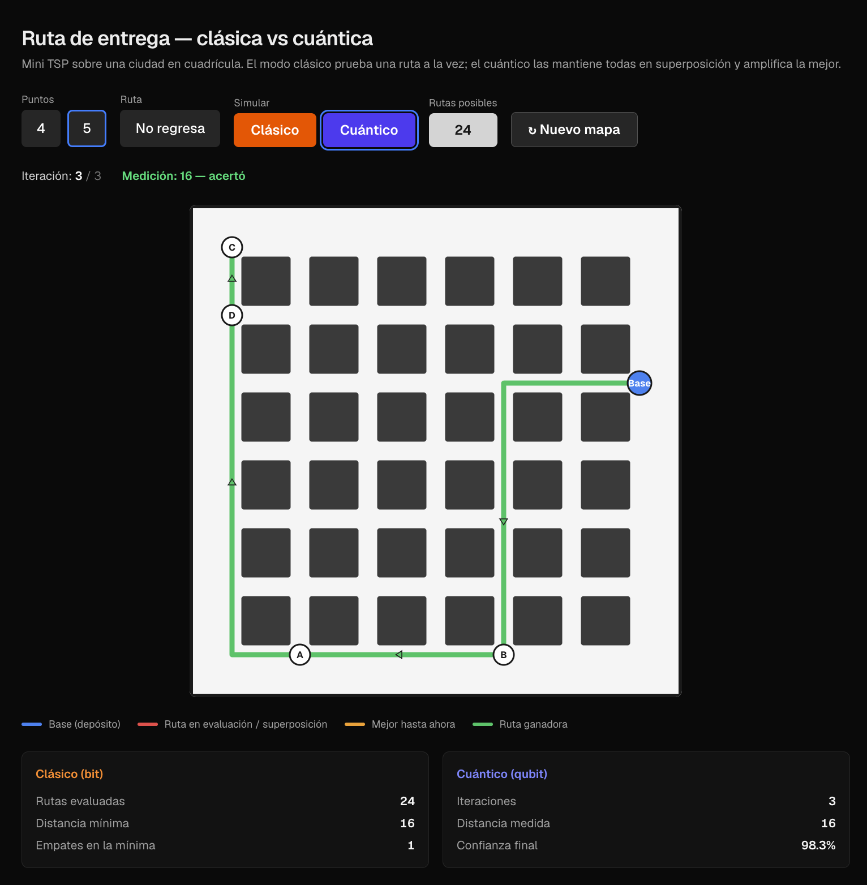

# Ruta de entrega mediante computación cuántica y clásica

> Simulador visual de una ruta de entrega óptima (mini TSP) sobre una ciudad en
> cuadrícula, resuelta de dos formas sobre el mismo mapa: **fuerza bruta clásica
> (bit)** y **amplificación de probabilidad cuántica (qubit)**.



El objetivo no es solo encontrar la ruta más corta, sino **hacer visible la
diferencia** entre cómo la busca un bit y cómo la busca un qubit.

En la captura, sobre el mismo mapa de 5 puntos: el modo clásico tuvo que
evaluar **24 rutas** una por una; el cuántico llegó a la misma respuesta
(distancia **16**) en **3 iteraciones**, con **98.3%** de confianza.

---

## Índice

- [El problema](#el-problema)
- [Cómo se usa](#cómo-se-usa)
- [Parte 1 — Simulación clásica (bit)](#parte-1--simulación-clásica-bit)
- [Parte 2 — Simulación cuántica (qubit)](#parte-2--simulación-cuántica-qubit)
- [Modelo de ciudad](#modelo-de-ciudad)
- [Arquitectura, archivo por archivo](#arquitectura-archivo-por-archivo)
- [La API](#la-api)
- [Cómo correrlo](#cómo-correrlo)
- [Detalles que importan](#detalles-que-importan)
- [Estado del proyecto](#estado-del-proyecto)
- [Reglas de convivencia](#reglas-de-convivencia)
- [Qué cambió al integrar la rama `Analisar`](#qué-cambió-al-integrar-la-rama-analisar)
- [Especificación del caso](#especificación-del-caso)

---

## El problema

Es el **Problema del Agente Viajero** (TSP) a escala de juguete: un vehículo
sale de una base y debe visitar los otros 4 puntos recorriendo la menor
distancia posible.

Lo que hace interesante al TSP es que **no existe atajo**. No hay fórmula que
dé la respuesta: para estar *seguro* de cuál es la ruta más corta hay que
construir todas las rutas posibles, medirlas y quedarse con la menor.

### De dónde salen las 24 rutas

Con 5 puntos hay 5! = 120 ordenamientos. Pero al **fijar la base** (el vehículo
siempre sale del mismo depósito) solo se permutan los 4 restantes: 4! = **24
rutas**. Con 4 puntos son 3! = 6.

Ese número crece de forma brutal:

| Puntos | Rutas |
|---|---|
| 4 | 6 |
| 5 | **24** |
| 6 | 120 |
| 8 | 5 040 |
| 11 | 3 628 800 |

**Esa explosión combinatoria es el punto pedagógico de todo el proyecto.**

---

## Cómo se usa

La pantalla, de arriba abajo:

| Control | Qué hace |
|---|---|
| **Puntos** (4 / 5) | Cuántos destinos tiene el mapa. Cambia el total de rutas: 6 o 24. |
| **Ruta** | Alterna entre *No regresa* (el caso del enunciado) y *Regresa a la base* (TSP cerrado clásico). |
| **Clásico** | Anima la búsqueda por fuerza bruta. |
| **Cuántico** | Anima la amplificación de probabilidad. |
| **Rutas posibles** | `(n-1)!` — cuántas rutas hay que considerar. |
| **Nuevo mapa** | Genera puntos aleatorios nuevos. |

Debajo, la **barra de estado** muestra el contador en vivo: *rutas evaluadas*
en clásico, *iteración* en cuántico. Y al final, el resultado.

El **mapa** dibuja la ciudad y las rutas. La **leyenda** explica los colores:

| Color | Significa |
|---|---|
| Azul | La base / depósito (punto de partida, siempre fijo) |
| Rojo | Ruta en evaluación (clásico) o en superposición (cuántico) |
| Ámbar | La mejor ruta encontrada hasta ese momento (solo clásico) |
| Verde | La ruta ganadora |

Al pie, las **tarjetas de comparación**: lo que le costó a cada modo llegar al
mismo resultado.

> **Los dos modos corren sobre el mismo mapa.** El escenario se pide una sola
> vez y ambos botones lo animan encima. Para cambiar de mapa está *Nuevo mapa*.
> Sin eso, comparar 24 rutas contra 3 iteraciones sobre mapas distintos no
> probaría nada.

---

## Parte 1 — Simulación clásica (bit)

Un bit está en **un solo estado a la vez**: 0 o 1, nunca ambos. Trasladado a la
simulación, el programa evalúa **una ruta a la vez**, en secuencia.

### Qué hace, paso por paso

1. Toma los 5 puntos con sus coordenadas.
2. Fija el primero como base y genera las permutaciones de los demás.
3. Para cada permutación, suma la distancia de sus tramos consecutivos.
4. Compara esa suma contra la mejor encontrada hasta ahora; si es menor, la guarda.
5. Incrementa el contador de rutas evaluadas.
6. Al terminar las 24, resalta la ganadora.

### Qué se ve en pantalla

Una sola ruta roja a la vez, cambiando en cada intento, con la campeona vigente
en ámbar al fondo. El contador sube de 1 a 24. Al terminar, el mapa se limpia y
queda solo la ganadora en verde.

### Por qué NO se optimiza

`clasico.py` lleva escrita esa advertencia en el encabezado. Nada de vecino más
cercano, programación dinámica ni poda por cota.

Si el clásico se vuelve listo, **deja de ser el grupo de control** y la
comparación contra el modo cuántico pierde el sentido. Su trabajo es ser
exhaustivo y honesto, no rápido.

---

## Parte 2 — Simulación cuántica (qubit)

Es una **simulación** de amplificación de amplitud (Grover) corriendo en una
computadora normal. No hay hardware cuántico ni librerías cuánticas.

### Qué hace, paso por paso

1. **Superposición inicial.** Cada una de las 24 rutas es un estado, todas con
   la misma amplitud `1/√24`, o sea probabilidad `1/24 = 4.17%` — exactamente
   la "probabilidad inicial igual" que pide el enunciado.

2. **Cada iteración aplica el Mecanismo A en dos tiempos:**

   - **Oráculo** — invierte el signo de la amplitud de las rutas que cumplen la
     condición (distancia mínima).
   - **Difusión** — refleja todas las amplitudes alrededor de su promedio
     ("inversión sobre la media").

   El efecto neto: la amplitud de las rutas marcadas sube y la del resto baja.

3. **La probabilidad es la amplitud al cuadrado**, y es lo que el frontend usa
   como opacidad. Las rutas malas se desvanecen solas; nadie las borra a mano.

4. **Medición final ponderada.** No se elige el máximo: se muestrea según las
   probabilidades, que es lo que hace una medición real.

### Cuántas iteraciones, y por qué

No es un número arbitrario ni aleatorio. Es el **óptimo de Grover**:

```
k = floor( (π/4) · √(N/M) )
```

con `N` rutas totales y `M` rutas marcadas. Para 24 rutas con una sola
ganadora da `k = 3`, y la probabilidad de medir la correcta queda en ~98%.

### Qué se ve en pantalla

Las 24 rutas dibujadas **a la vez**, semi-transparentes. Iteración a iteración
las malas se van desvaneciendo hasta que solo queda una brillante. El contador
muestra la iteración y la confianza acumulada.

---

## Modelo de ciudad

La ciudad es una **cuadrícula tipo Manhattan**: calles horizontales y verticales
que se cruzan en nodos de coordenadas enteras (`0..grid_size`, por defecto 6).
Los destinos caen sobre esos nodos y el vehículo circula por las calles, nunca
en diagonal.

La distancia es **Manhattan** (`|dx| + |dy|`) y **no es configurable**: si el
vehículo va por las calles, permitirle cortar en diagonal no sería fiel al
modelo. Los dos modos la comparten, que es lo que hace válida la comparación.

Las coordenadas que expone la API son **de cuadrícula, no píxeles** — el
frontend las escala al canvas que quiera dibujar.

Sobre el dibujo: entre cada par de puntos, el trazo avanza primero en
horizontal y luego en vertical (una "L"). Es una simplificación visual válida
porque la distancia Manhattan es idéntica sin importar dónde se dé el giro.

---

## Arquitectura, archivo por archivo

```
.
├── backend/                      Toda la lógica (Python)
│   ├── app/
│   │   ├── geometria.py          ← COMPARTIDO
│   │   ├── esquemas.py           ← COMPARTIDO
│   │   ├── clasico.py            ← Parte 1
│   │   ├── cuantico.py           ← Parte 2
│   │   └── main.py               ← COMPARTIDO
│   ├── tests/                    53 pruebas
│   └── requirements.txt
│
└── frontend/                     Solo visualización (Next.js)
    └── src/
        ├── app/page.tsx          la pantalla
        ├── components/
        │   ├── CityMap.tsx       el mapa SVG
        │   └── Controles.tsx     panel y barra de estado
        ├── hooks/
        │   └── useSimulacion.ts  reproduce las trazas
        └── lib/
            ├── tipos.ts          espejo del contrato del backend
            ├── api.ts            cliente HTTP
            └── mapa-geometria.ts cuadrícula → píxeles y trazos SVG
```

### Backend

| Archivo | Qué hace |
|---|---|
| **`geometria.py`** | La base que ambos modos comparten: `Punto`, la distancia Manhattan, `rutas_posibles()` (las permutaciones con la base fija), `medir_todas_las_rutas()` (el catálogo con sus distancias), `indices_mas_cortas()` (detecta empates) y `generar_puntos()` (mapas aleatorios o reproducibles por semilla). |
| **`clasico.py`** | La Parte 1. Recorre el catálogo ruta por ruta y devuelve la traza: un frame por cada ruta evaluada, con su distancia, si rompió el récord y cuál era la campeona en ese momento. |
| **`cuantico.py`** | La Parte 2. Amplitudes, oráculo, difusión, y la traza con la probabilidad de todas las rutas en cada iteración. Más la medición final ponderada. |
| **`esquemas.py`** | El contrato de la API en modelos Pydantic. Lo que el backend promete y el frontend consume. |
| **`main.py`** | La app FastAPI: CORS y los cinco endpoints. No calcula nada, solo orquesta. |

### Frontend

| Archivo | Qué hace |
|---|---|
| **`lib/tipos.ts`** | El espejo en TypeScript de `esquemas.py`. Única fuente de verdad del frontend sobre la forma del JSON. |
| **`lib/api.ts`** | El `fetch` al backend. Nada más. |
| **`lib/mapa-geometria.ts`** | Convierte coordenadas de cuadrícula a píxeles y arma los trazos SVG (incluidas las flechas de dirección). También traduce probabilidad a opacidad. No pinta: solo calcula. |
| **`components/CityMap.tsx`** | Dibuja calles, edificios, puntos y rutas. **No calcula nada**: recibe todo resuelto. |
| **`components/Controles.tsx`** | El panel de botones y la barra de estado. |
| **`hooks/useSimulacion.ts`** | Toda la lógica de pantalla: pide el escenario y reproduce las trazas con un temporizador. |

> **Ningún cálculo de rutas ni distancias vive en el frontend.** Esa fue una
> regla desde el principio: la lógica en Python, el navegador solo dibuja.

---

## La API

| Método | Ruta | Para qué |
|---|---|---|
| `GET` | `/health` | Salud. |
| `GET` | `/api/v1/puntos` | Genera el mapa. |
| `POST` | `/api/v1/clasico/simular` | Traza del modo clásico. |
| `POST` | `/api/v1/cuantico/simular` | Traza del modo cuántico. |
| `GET` | `/api/v1/escenario` | Mapa + los dos modos en una sola llamada. |

**Desde el frontend se usa `/escenario`.** Al resolver todo de un tiro, ambos
modos comparten los mismos puntos por construcción.

```bash
curl "http://127.0.0.1:8000/api/v1/escenario?n=5&semilla=42"
```

| Parámetro | Default | Nota |
|---|---|---|
| `n` | `5` | 2–8 destinos |
| `grid_size` | `6` | Manzanas por lado |
| `cerrada` | `false` | `true` = regresa al depósito |
| `orden` | `secuencial` | o `aleatorio` (modo clásico) |
| `semilla` | — | Fija el mapa y la medición final |

### Decisión de diseño: el backend manda la traza completa

La simulación **no** se pide paso por paso. Una sola llamada devuelve **todos
los frames ya ordenados** y el frontend los reproduce al ritmo que quiera.

1. El servidor **no guarda estado** entre frames.
2. **No hay round-trip de red por frame** — la animación no depende de la latencia.
3. **El tempo es decisión del frontend.** Pausar, acelerar o retroceder es
   cambiar un índice en un arreglo.

El detalle completo de ambas respuestas está en
[backend/README.md](backend/README.md).

---

## Cómo correrlo

Hacen falta **dos terminales**.

### Backend

```bash
cd backend
pip install -r requirements.txt
python3 -m uvicorn app.main:app --reload --port 8000
```

Docs interactivas (Swagger): <http://127.0.0.1:8000/docs>

> El backend **no tiene página en la raíz**: entrar a `http://127.0.0.1:8000`
> da 404 y eso es normal. La interfaz está en el 3000.

### Frontend

```bash
cd frontend
npm install
npm run dev            # http://localhost:3000
```

El backend ya trae CORS habilitado para `localhost:3000`.

### Pruebas

Corren con la librería estándar, sin instalar nada extra:

```bash
cd backend
python3 -m unittest discover -s tests -v      # 53 pruebas
```

Entre ellas, la que sostiene el proyecto: que **ambos modos coincidan en la
ruta más corta**, verificado sobre 8 mapas distintos en ruta abierta y cerrada.

---

## Detalles que importan

### Los empates son la norma, no la excepción

Con distancia Manhattan sobre coordenadas enteras, varias rutas distintas miden
exactamente lo mismo (y en ruta cerrada, cada ruta y su reversa **siempre**
empatan). Por eso el clásico reporta `empates_en_la_mejor` y el cuántico marca
todas las mínimas y ajusta sus iteraciones según cuántas sean.

**Es normal que ambos modos devuelvan rutas distintas con la misma distancia.**
No es un bug: es un empate legítimo.

### Pasarse del óptimo empeora el resultado

Más iteraciones **no** es mejor: la amplitud vuelve a bajar. Es una propiedad
real de Grover, y el parámetro `?iteraciones=` permite demostrarla en vivo:

| Iteraciones | Confianza |
|---|---|
| 1 | 0.3345 |
| 2 | 0.7331 |
| **3 (óptimo)** | **0.9827** |
| 4 | 0.9240 |
| 6 | 0.2045 |
| 9 | 0.4788 |

### El modo cuántico puede fallar

La medición final es un muestreo ponderado, así que con ~2% de probabilidad
cae en una ruta que no es la mínima. La respuesta trae el campo `acerto` y la
interfaz lo muestra. **Enseñar ese fallo ocasional vale más que esconderlo**:
es exactamente lo que significa que un algoritmo cuántico sea probabilístico.

---

## Estado del proyecto

| Componente | Responsable | Estado |
|---|---|---|
| Geometría compartida (cuadrícula, distancias, catálogo de rutas) | — compartido — | ✅ Listo |
| Contrato de la API (esquemas Pydantic) | — compartido — | ✅ Listo |
| Generador de mapas con semilla reproducible | — compartido — | ✅ Listo |
| **Parte 1 — Simulación clásica (bit)** | Daniel | ✅ Listo |
| **Parte 2 — Simulación cuántica (qubit)** | compañero | ✅ Portado · **pendiente su revisión** |
| Endpoint `/escenario` | compartido | ✅ Listo |
| Canvas compartido (`CityMap`) | compartido | ✅ Listo |
| Frontend de ambos modos | compartido | ✅ Listo |
| Pruebas del backend | compartido | ✅ 53 pruebas |

---

## Reglas de convivencia

Somos dos personas sobre el mismo canvas y el mismo backend. Cuatro acuerdos:

**1. `geometria.py` y `esquemas.py` son territorio compartido.**
Si la simulación clásica y la cuántica miden las rutas distinto, la comparación
final no significa nada. Cambios ahí se avisan antes.

**2. `clasico.py` no se optimiza. Nunca.**
Es deliberadamente exhaustivo porque es el **grupo de control**.

**3. Los dos modos corren sobre el mismo mapa.**
Usando `/escenario` sale gratis.

**4. Ramas de integración, no commits directos a `main` cuando el cambio toca
lo compartido.** Así nadie se baja un estado a medias.

---

## Qué cambió al integrar la rama `Analisar`

La rama del compañero era un historial independiente (sin ancestro común con
`main`) que reimplementaba el proyecto completo. Se combinó tomando lo mejor de
cada lado.

### Lo que se adoptó de su rama

| Suyo | Por qué |
|---|---|
| **Ciudad en cuadrícula + distancia Manhattan** | Más fiel al *"mapa tipo maps"*: un vehículo de reparto circula por calles, no en diagonal. |
| **Una sola llamada resuelve todo el escenario** | Garantiza por construcción que ambos modos comparten el mapa. Quedó como `/api/v1/escenario`. |
| **El mapa SVG (`CityMap`)** | Calles, edificios, trazos en "L" y flechas de dirección. Portado casi tal cual. |
| **Vista de "visibles / eliminadas por ronda"** | Se conserva en la traza cuántica. |
| **Orden aleatorio de evaluación** | Quedó como opción `orden=aleatorio` del modo clásico. |

### Lo que se conservó de nuestro stack

Paquete `app/` con módulos separados, esquemas Pydantic tipados, mapas
reproducibles por semilla, traza completa en una llamada, y la batería de
pruebas.

### Tres cambios sobre su versión — **la última palabra es suya**

1. **La ganadora ya no se inyecta.** Su versión recibía `mejor_ruta_id` ya
   calculado y lo protegía de la eliminación, así que la simulación no
   *encontraba* la ruta: se le entregaba y coreografiaba el desvanecimiento
   alrededor. Ahora sale de las probabilidades.

2. **El número de rondas ya no es aleatorio.** Era `random.randint(4, 8)`,
   elegido para "verse rápido". Ahora es el óptimo de Grover.

3. **Los dos modos corren sobre el mismo mapa.** En su versión cada click pedía
   un escenario nuevo, así que clásico y cuántico nunca veían los mismos
   puntos.

Además se implementaron las **probabilidades** que pide el enunciado y la
**medición final ponderada**, que su versión no tenía: eliminaba rutas por
conjuntos, sin probabilidad asociada.

> **Sobre la circularidad del oráculo:** sí, para *simular* el oráculo hay que
> saber cuáles rutas son mínimas. Eso es inherente a simular Grover en una
> máquina clásica y no es trampa — en el modelo, el oráculo es una caja negra
> que reconoce una solución sin que el buscador sepa cuál es. Lo que se cuenta y
> se compara contra el modo clásico son las **consultas al oráculo**, que es
> justo donde Grover afirma su ventaja: ~√N contra N.

---

## Especificación del caso

> **Caso 3 — Ruta óptima de entrega (mini TSP, 4 a 5 puntos)**

**Problemática.** Un dron de entrega debe visitar 4 o 5 puntos siguiendo la ruta
más corta posible.

**Mecanismo cuántico.** A — Amplificación de probabilidad (aplicada a rutas en
vez de casillas).

**Entrada.** Coordenadas de 4-5 puntos en un canvas (fijas o generadas al azar
al reiniciar).

**Salida esperada.** La ruta más corta encontrada por cada modo y cuántos
caminos evaluó cada uno.

### Parte 1 — Simulación clásica (bit)

- Calcular todas las permutaciones posibles de los puntos (para 5 puntos son
  4! = 24 rutas, fijando el punto de partida).
- Dibujar cada ruta una por una sobre el mapa, calculando su distancia total, y
  llevar un contador de rutas evaluadas.
- Al terminar, resaltar la ruta de menor distancia total encontrada.

### Parte 2 — Simulación cuántica (qubit)

- Generar el mismo conjunto de rutas posibles (las mismas permutaciones) pero
  dibujarlas todas a la vez, semi-transparentes, sobre el mismo mapa — esto
  representa la superposición.
- Asignar a cada ruta una probabilidad inicial igual (1 / total de rutas).
- En cada iteración, aplicar el Mecanismo A: subir la probabilidad de la ruta
  más corta (la que cumple la condición) y bajar la de las demás; reflejar esto
  visualmente bajando la opacidad de las rutas menos probables en cada paso,
  hasta que solo quede una brillante.
- Medir al final con la función ponderada y resaltar la ruta resultante como la
  elegida.

### Elementos visuales obligatorios

- Mapa o canvas con los puntos y líneas de ruta dibujadas.
- **Modo clásico:** una sola ruta visible a la vez, cambiando en cada intento.
- **Modo cuántico:** todas las rutas visibles a la vez, desvaneciéndose las
  malas iteración a iteración.
- Contador de **rutas evaluadas** (clásico) vs. **iteraciones** (cuántico).
